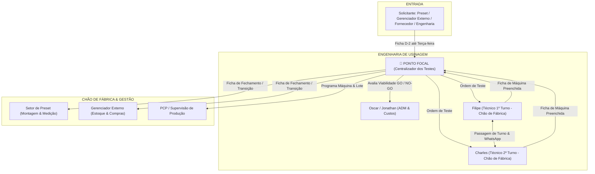
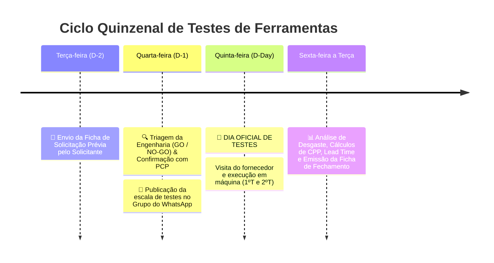

# PROCEDIMENTO OPERACIONAL PADRÃO (POP)
## GESTÃO E HOMOLOGAÇÃO DE TESTES DE FERRAMENTAS DE USINAGEM

---

### 1. OBJETIVO
Padronizar a entrada, planejamento, acompanhamento em chão de fábrica, validação técnica/econômica e transição de estoque para testes de novas ferramentas de corte na fábrica, garantindo:
- Paradas de máquina planejadas e sem impacto nas metas do PCP.
- Governança 100% centralizada na **Engenharia de Usinagem**.
- Rastreabilidade total entre turnos (1º e 2º Turno).
- Comprovação real de ganho técnico (vida útil/ciclo) e financeiro (Custo por Peça - CPP).
- **Garantia de abastecimento, lead time e transição segura de estoque antes da homologação final.**

---

### 2. ESTRUTURA DA EQUIPE E RESPONSABILIDADES (MATRIZ RACI)

#### Papéis:
1. **🎯 Ponto Focal (Centralizador dos Testes - Engenharia):**
   - Recebe e tria todas as solicitações prévias (D-2).
   - Emite o parecer preliminar de viabilidade (**GO / NO-GO**).
   - Alinha com PCP a disponibilidade de máquina e lote de peças.
   - Emite a **Ficha de Fechamento** com parecer técnico, ROI e plano de abastecimento.
   - Dá o aval final de **Homologação / Reprovação**.

2. **Oscar / Jonathan (ADM / Engenharia):**
   - Análise de custos, cálculo de Custo por Peça (CPP) e retorno de investimento.
   - Suporte técnico e apoio nas decisões de compra e engenharia de processos.

3. **Filipe (Técnico 1º Turno) & Charles (Técnico 2º Turno):**
   - Acompanhamento presencial no chão de fábrica durante a montagem e usinagem.
   - Conferência de parâmetros ($Vc, fz, ap, ae$), fixação, balanço e refrigeração.
   - Registro rigoroso de peças usinadas e desgaste na **Ficha de Acompanhamento de Máquina**.
   - Atualizações em tempo real no **Grupo de WhatsApp de Testes** (com fotos da aresta de corte).
   - Passagem de bastão formal entre 1º e 2º turno.

4. **Preset & Gerenciador Externo de Ferramentas:**
   - Apoio na sugestão de melhorias e envio da Ficha de Solicitação Prévia.
   - Montagem e medição no preset conforme dados da Engenharia.
   - Execução do plano de transição de estoque após aprovação formal.

---

### 3. O FLUXO OPERACIONAL (CRONOGRAMA QUINZENAL)

#### Regras Mandatórias:
1. **Janela Exclusiva de Testes:** Quinta-feira, de 15 em 15 dias. Testes fora dessa data só ocorrem em caráter de extrema emergência com autorização expressa da Engenharia.
2. **Prazo de Solicitação (D-2):** Nenhuma ferramenta entra em máquina sem a Ficha de Solicitação enviada até **terça-feira às 17h**.
3. **Amostras Bonificadas:** Todas as ferramentas para teste devem ser fornecidas sem custo pelo fornecedor.
4. **Identificação na Máquina:** Toda ferramenta em teste deve conter tag visual: **"FERRAMENTA EM TESTE - NÃO ALTERAR PARÂMETROS / NÃO REMOVER"**.

---

### 4. CRITÉRIOS DE AVALIAÇÃO E HOMOLOGAÇÃO
Para ser aprovada, a ferramenta de teste deve cumprir cumulativamente:
1. **Critério Técnico:** Vida útil mínima ou redução de tempo de ciclo conforme meta pré-estabelecida, mantendo rugosidade ($Ra/Rz$), tolerância dimensional e escoamento de cavaco estável.
2. **Critério Econômico:** Redução comprovada no Custo por Peça (CPP $\ge$ meta acordada).
3. **Critério de Abastecimento & Logística (OBRIGATÓRIO):**
   - Lead time do fornecedor compatível com a demanda da fábrica.
   - Existência de distribuidor local / estoque de segurança do fornecedor.
   - Plano claro de queima do estoque antigo (runout) sem ruptura de abastecimento.

---

### 5. DOCUMENTOS DO SISTEMA
- `01_FICHA_SOLICITACAO_PREVIA_TESTE.md`
- `02_FICHA_ACOMPANHAMENTO_CHAO_DE_FABRICA.md`
- `03_FICHA_FECHAMENTO_VALIDACAO_E_TRANSICAO_ESTOQUE.md`
- `04_GUIA_RAPIDO_GRUPO_WHATSAPP.md`
