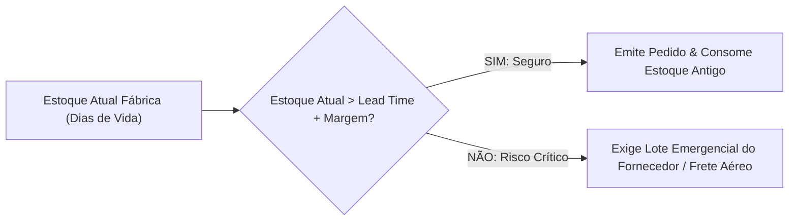

# FICHA DE FECHAMENTO, VALIDAÇÃO & TRANSIÇÃO DE ESTOQUE
**Engenharia de Usinagem | Relatório Técnico & Matriz de Homologação**

---

### 1. DADOS DO TESTE
| Item | Informação |
| :--- | :--- |
| **Nº do Relatório / Teste:** | `TESTE-____/2026` |
| **Data de Conclusão:** | `____/____/2026` |
| **🎯 Ponto Focal (Engenharia):** | |
| **Peça / Operação:** | |
| **Máquina Utilizada:** | |
| **Fornecedor Testado:** | |
| **Ferramenta Testada (Código):** | |
| **Ferramenta Atual (Referência):** | |

---

### 2. RESULTADOS TÉCNICOS OBTIDOS

| Indicador Técnico | Ferramenta Atual | Ferramenta Teste | Variação (%) | Status Técnico |
| :--- | :---: | :---: | :---: | :---: |
| **Vida Útil (Peças / Aresta):** | | | **____ %** | [ ] Atingiu Meta [ ] Abaixo |
| **Tempo de Ciclo da Operação ($T_c$):** | ____ s | ____ s | **____ %** | [ ] Mais Rápido [ ] Igual/Lento |
| **Rugosidade Superficial ($Ra$):** | ____ $\mu\text{m}$ | ____ $\mu\text{m}$ | - | [ ] Conforme [ ] Não Conforme |
| **Estabilidade Dimensional:** | Conforme | Conforme / Não | - | [ ] Aprovado [ ] Reprovado |
| **Desgaste / Comportamento:** | Padrão | [ ] Desgaste Uniforme &nbsp; [ ] Quebra Prematura &nbsp; [ ] Lascamento | - | [ ] Aprovado [ ] Reprovado |

---

### 3. ANÁLISE ECONÔMICA (CUSTO POR PEÇA - CPP & ROI)

$$\text{Custo da Ferramenta por Peça (CPP)} = \frac{\text{Preço do Inserto ou Ferramenta}}{\text{Nº de Arestas Úteis} \times \text{Peças por Aresta}}$$

| Parâmetro Financeiro | Ferramenta Atual | Ferramenta Teste | Economia Unitária |
| :--- | :---: | :---: | :---: |
| **Preço Unitário da Ferramenta (R$):** | R$ | R$ | - |
| **Nº de Arestas Úteis / Afiações:** | | | - |
| **Peças Usinadas por Inserto/Ferramenta:** | | | - |
| **Custo de Ferramenta por Peça (CPP):** | **R$ / peça** | **R$ / peça** | **R$ ______ / peça** |
| **Volume Mensal de Peças Produzidas:** | | | - |
| **Economia Estimada por Mês (R$):** | - | - | **R$ ____________ / mês** |
| **Economia Estimada Anual (R$):** | - | - | **R$ ____________ / ano** |

---

### 4. ⚠️ MATRIZ CRÍTICA DE ABASTECIMENTO, LEAD TIME & TRANSIÇÃO DE ESTOQUE
> **TRAVA OBRIGATÓRIA:** Nenhuma ferramenta é homologada se houver risco de parada de fábrica por ruptura de estoque durante a transição.

| Parâmetro Logístico / Estoque | Dado Levantado | Análise de Risco |
| :--- | :---: | :--- |
| **Lead Time de Entrega do Novo Fornecedor:** | ______ dias úteis | Tempo real entre emissão do pedido e entrega física na fábrica. |
| **Fornecedor possui estoque local / distribuidor?** | [ ] SIM &nbsp; [ ] NÃO | Se NÃO, risco de desabastecimento em variações de demanda. |
| **Lote Mínimo de Compra (MOQ):** | ______ peças | Quantidade mínima exigida no faturamento. |
| **Estoque Atual da Ferramenta Antiga no Almox/Preset:** | ______ insertos/pcs | Quantidade física disponível na fábrica hoje. |
| **Consumo Mensal Médio da Fábrica:** | ______ insertos/mês | Consumo histórico da linha de produção. |
| **Autonomia do Estoque Antigo Restante (Dias):** | **______ dias** | $\text{Dias} = \frac{\text{Estoque Antigo}}{\text{Consumo Médio Diário}}$ |

#### Cálculo da Margem de Segurança da Transição:
$$\text{Margem de Cobertura (Dias)} = \text{Autonomia do Estoque Antigo (Dias)} - \text{Lead Time do Novo Fornecedor (Dias)}$$

* **Margem Calculada:** **______ dias de sobra**
* **Classificação de Risco:**
  - [ ] **🟢 TRANSIÇÃO SEGURA:** Margem $\ge 15$ dias. Pedido pode ser emitido no fluxo normal enquanto consome o saldo antigo.
  - [ ] **🟡 TRANSIÇÃO MODERADA:** Margem entre 5 e 14 dias. Acompanhar diariamente o frete do novo fornecedor.
  - [ ] **🔴 RISCO CRÍTICO DE RUPTURA:** Margem $< 5$ dias. **PROIBIDO VIRAR O PROCESSO** sem garantia de lote emergencial / pronta entrega do fornecedor.

---

### 5. PLANO DE AÇÃO PARA VIRADA DE LINHA (CHECKLIST DE IMPLANTAÇÃO)
Preencher somente se o teste for aprovado:
- [ ] **Fornecedor / Gerenciador Externo:** Código cadastrado no sistema ERP / Gerenciador de Ferramentas.
- [ ] **Preset:** Ficha de montagem e corretor de altura/raio atualizado no Preset.
- [ ] **Programação CNC / Engenharia:** Programa ajustado com novos parâmetros de corte definitivos.
- [ ] **Suprimentos / Compras:** 1º Pedido de compra emitido na data: `____/____/2026` (Nº Pedido: ____________).
- [ ] **Almoxarifado / Gerenciador:** Bloqueio de novas compras da ferramenta antiga (queima até o saldo zero).

---

### 6. PARECER FINAL & AVAL DA ENGENHARIA DE USINAGEM

| Decisão Final | Justificativa Sintética |
| :--- | :--- |
| **[ &nbsp; ] HOMOLOGADO INTEGRALMENTE** | Aprovado tecnicamente, economicamente e com plano de transição de estoque validado sem risco de abastecimento. |
| **[ &nbsp; ] APROVADO TECNICAMENTE, MAS BLOQUEADO POR SUPRIMENTOS** | Ferramenta com ótimo desempenho, porém com Lead Time inviável ou custo/estoque sem garantia. Fica como 2ª opção / backup. |
| **[ &nbsp; ] REPROVADO** | Não atingiu critérios técnicos mínimos de vida útil, acabamento ou estabilidade. |
| **[ &nbsp; ] RETESTE NECESSÁRIO** | Teste inconclusivo por motivos externos (quebra de máquina, lote de material defeituoso). |

---

### 7. ASSINATURAS DE APROVAÇÃO

| Responsabilidade | Nome | Visto / Assinatura | Data |
| :--- | :--- | :--- | :---: |
| **🎯 Ponto Focal (Engenharia):** | | ______________________________ | `____/____/2026` |
| **Engenharia ADM:** | Oscar / Jonathan | ______________________________ | `____/____/2026` |
| **Técnicos de Chão de Fábrica:** | Filipe / Charles | ______________________________ | `____/____/2026` |
| **Preset / Gerenciador Externo:** | | ______________________________ | `____/____/2026` |
