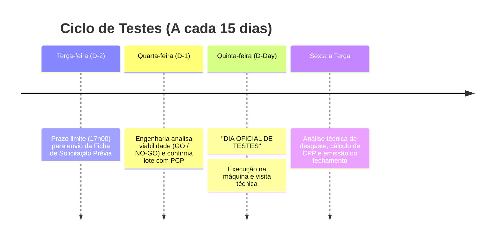

# APRESENTAÇÃO EXECUTIVA: NOVO MODELO DE GESTÃO DE TESTES DE FERRAMENTAS
**Engenharia de Usinagem | Apresentação para Preset, Gerenciador Externo e Produção**

---

## 🎯 OBJETIVO DA REUNIÃO
Apresentar o novo fluxo padronizado para solicitação, execução, validação e transição de ferramentas na fábrica, eliminando testes de surpresa, falta de dados e paradas de linha não planejadas.

---

## 📊 SLIDE 1: ONDE ESTÁVAMOS vs. PARA ONDE VAMOS

| ❌ Como Funcionava Antes |  Como Funcionará a Partir de Agora |
| :--- | :--- |
| Testes iniciados sem aviso prévio à Engenharia. | **100% dos testes iniciam apenas com aval prévio da Engenharia.** |
| Acompanhamento parcial ou esquecido no 2º turno. | **Técnicos dedicados:** Filipe (1ºT) e Charles (2ºT) com passagem formal. |
| Dados perdidos e decisões baseadas em "opinião". | **Fichas técnicas padronizadas + Análise de Custo por Peça (CPP).** |
| Risco de falta de ferramenta no estoque após aprovação. | **Trava obrigatória de Lead Time e Análise de Transição de Estoque.** |

---

## 👥 SLIDE 2: EQUIPE TÉCNICA & PONTO FOCAL

A Engenharia de Usinagem definiu papéis claros para garantir suporte total a quem sugerir melhorias:

* **🎯 Ponto Focal (Centralizador):** Porta de entrada única, aprovação prévia (**GO/NO-GO**) e emissão da Ficha de Fechamento.
* **Oscar & Jonathan (ADM):** Suporte técnico, análise de viabilidade econômica (ROI) e engenharia de processos.
* **Filipe (Técnico 1º Turno):** Acompanhamento em máquina no chão de fábrica no primeiro turno.
* **Charles (Técnico 2º Turno):** Continuidade e acompanhamento em máquina no segundo turno.

---

## 📅 SLIDE 3: O CRONOGRAMA OFICIAL (JANELA QUINZENAL)

> **"Organização gera produtividade."** Não paramos máquinas em dias aleatórios.

---

## 📋 SLIDE 4: O QUE É AVALIADO NA FICHA DE SOLICITAÇÃO (TERÇA-FEIRA)?

Para a Engenharia aprovar a realização do teste na quinta-feira, precisamos de **5 respostas simples**:
1. **Quem é o fornecedor e quem acompanhará?**
2. **Qual é a peça, material e máquina alvo?**
3. **Qual é o desempenho da ferramenta atual (peças/aresta e custo)?**
4. **O que a nova ferramenta promete? (Meta de vida útil ou redução de tempo de ciclo).**
5. **As amostras foram bonificadas pelo fornecedor?**

---

## 📱 SLIDE 5: COMUNICAÇÃO TRANSPARENTE VIA WHATSAPP

Criamos um **Grupo Oficial de Testes** com templates rápidos e fotos:
- 🟡 `[INÍCIO DE TESTE]`: Informa a toda a fábrica qual máquina e peça estão rodando teste.
- 🔵 `[STATUS / PASSAGEM DE TURNO]`: Filipe passa o bastão para Charles com fotos da aresta e contagem de peças.
- ⚠️ `[ALERTA / INTERCORRÊNCIA]`: Aviso imediato se houver quebra ou vibração.
- 🏁 `[FIM DE TESTE EM MÁQUINA]`: Resumo do resultado alcançado.

---

## ⚠️ SLIDE 6: A NOVA TRAVA DE SEGURANÇA (LEAD TIME & ESTOQUE)

> **"Ferramenta aprovada tecnicamente só entra em linha se houver garantia de abastecimento."**

A **Ficha de Fechamento** calcula automaticamente:
$$\text{Autonomia do Estoque Antigo (Dias)} \ge \text{Lead Time do Novo Fornecedor (Dias)} + 15\text{ Dias de Margem}$$

Se o novo fornecedor demorar mais tempo para entregar do que o estoque antigo dura na fábrica, **a virada é bloqueada** até a chegada de um lote emergencial. **Fábrica nunca mais fica sem ferramenta!**

---

## 🤝 SLIDE 7: GANHO PARA TODAS AS ÁREAS

* **Para o Preset:** Processo organizado, ferramentas cadastradas com padrão técnico e sem retrabalho.
* **Para o Gerenciador Externo:** Previsibilidade de compras, prazos respeitados e redução comprovada de custos.
* **Para a Produção / PCP:** Máquinas paradas apenas na janela programada, sem surpresas na meta de peças.
* **Para a Engenharia:** Rastreabilidade, dados confiáveis e decisões técnicas sólidas.
